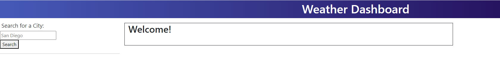
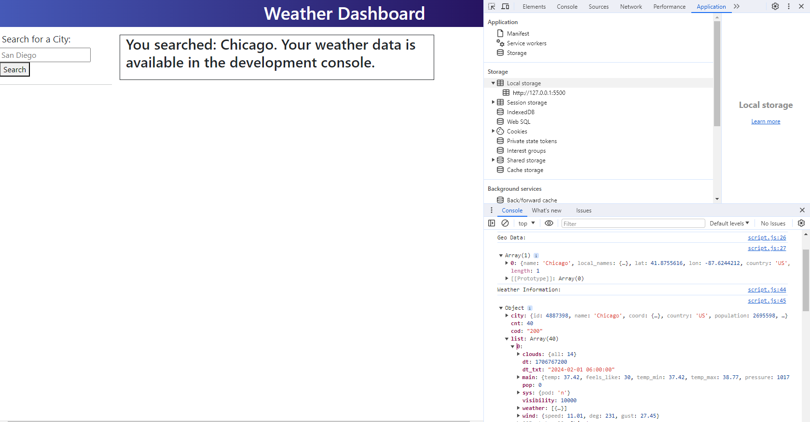
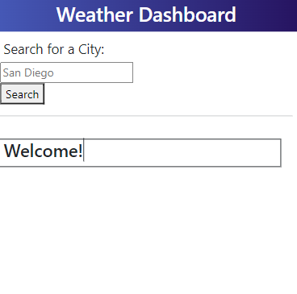

# Weather Dashboard

## The goal of this project was to create a weather dashboard application that requests weather data for a city and displays it in a manner suitable for a user.  The data will be retrieved from the OpenWeather API library and will contain a 5 day weather forecast for any city that is requested in a search.

I learned the following:
- How to user function parameters and lessen my use of global variables.
- The importance of reading API documentation. 

## Usage

The final website can be viewed here:
https://briandwach.github.io/weather-dashboard/

- In the search text box, type in the city in which you are traveling.
- The welcome box will confirm the city you have searched and inform you to find your data in the development console. 
- In the development console, data will have been retrieved for the geo location of the city and the city's 5 day weather forecast. 
- Data is provided by the OpenWeather API.

The code repository can be accessed here:
https://github.com/briandwach/weather-dashboard/

  

## Credits

I used the jass.css reset stylesheet that I was introduced to in my class and can be found in the Northwestern University GitLab repository: NU-VIRT-FSF-PT-12-2023-U-LOLC

at the following private link:
https://git.bootcampcontent.com/Northwestern-University/NU-VIRT-FSF-PT-12-2023-U-LOLC/-/tree/main/03-JavaScript/02-Challenge?ref_type=heads

Third-Party APIs

OpenWeather API
To retrieve weather data
https://openweathermap.org/forecast5

Bootstrap
For layout and stylings
https://cdn.jsdelivr.net/npm/bootstrap@5.1.3/dist/css/bootstrap.min.css

jQuery
For DOM traversal and event handling 
https://code.jquery.com/jquery-3.4.1.min.js